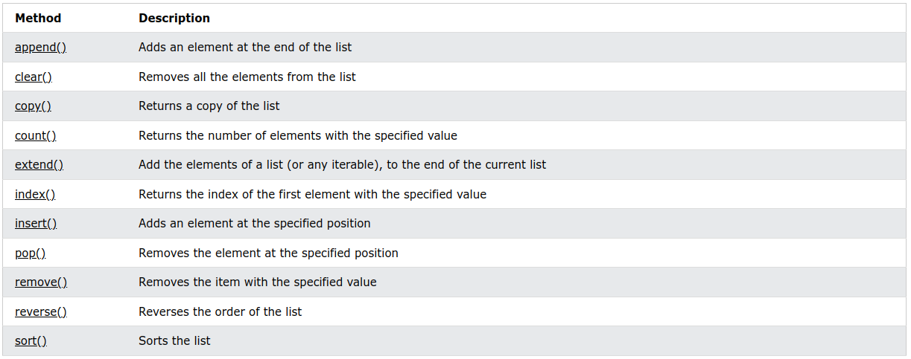

# Python - Les listes

```python
mylist = ["apple", "banana", "cherry"]
```

## Listes

Les listes sont utilisées pour stocker plusieurs éléments dans une seule variable.

Les __listes__ sont l'un des 4 types de données intégrés dans Python utilisés pour stocker des collections de données, les 3 autres sont __Tuple__, __Set__ et __Dictionary__, tous avec des qualités et une utilisation différentes.

Les listes sont créées à l'aide de crochets :

**Exemple**

Créer une liste
```python
thislist = ["apple", "banana", "cherry"]
print(thislist)
```

### Éléments de la liste

Les éléments de liste sont ordonnés, modifiables et autorisent les valeurs en double.

Les éléments de la liste sont indexés, le premier élément a l'index [0], le deuxième élément a l'index [1], etc.

### Ordered
Lorsque nous disons que les listes sont ordonnées, cela signifie que les éléments ont un ordre défini et que cet ordre ne changera pas.

Si vous ajoutez de nouveaux éléments à une liste, les nouveaux éléments seront placés à la fin de la liste.

>**Remarque** : Certaines [`méthodes de liste`](#method_list) modifient l'ordre, mais en général : l'ordre des éléments ne change pas.

### Changeable

La liste est modifiable, ce qui signifie que nous pouvons modifier, ajouter et supprimer des éléments dans une liste après sa création.

### Autoriser les doublons

Puisque les listes sont indexées, les listes peuvent avoir des éléments avec la même valeur :

**Exemple**

Les listes autorisent les valeurs en double :

```python
thislist = ["apple", "banana", "cherry", "apple", "cherry"]
print(thislist)
```

### Longueur de la liste

Pour déterminer le nombre d'éléments d'une liste, utilisez la fonction **len()** :

**Exemple**

Imprimer le nombre d'éléments dans la liste :

```python
thislist = ["apple", "banana", "cherry"]
print(len(thislist))
```

### Éléments de liste - Types de données

Les éléments de liste peuvent être de n'importe quel type de données :

**Exemple**

Types de données **chaîne**, **int** et **booléen** :

```python
list1 = ["apple", "banana", "cherry"]
list2 = [1, 5, 7, 9, 3]
list3 = [True, False, False]
```

Une liste peut contenir différents types de données :

**Exemple**

Une liste avec des chaînes, des entiers et des valeurs booléennes :

```python
list1 = ["abc", 34, True, 40, "male"]
```

### type()

Du point de vue de Python, les listes sont définies comme des objets avec le type de données 'list' :

```python
<class 'list'>
```

**Exemple**

Quel est le type de donnée de cette liste ?

```python
mylist = ["apple", "banana", "cherry"]
print(type(mylist))
```

### Le constructeur list()

Il est également possible d'utiliser le constructeur **list()** lors de la création d'une nouvelle liste.

**Exemple**

Utilisation du constructeur **list()** pour créer une Liste :

```python
thislist = list(("apple", "banana", "cherry")) # note the double round-brackets
print(thislist)
```

### Collections Python (Array)

Il existe quatre types de données de collecte dans le langage de programmation Python :

* **List** est une collection ordonnée et modifiable. Autorise les membres en double.
* **Tuple** est une collection ordonnée et immuable. Autorise les membres en double.
* **Set** est une collection non ordonnée, non modifiable* et non indexée. Aucun membre en double.
* **Dictionary** est une collection ordonnée** et modifiable. Aucun membre en double.

Lors du choix d'un type de collection, il est utile de comprendre les propriétés de ce type. Choisir le bon type pour un ensemble de données particulier pourrait signifier la conservation du sens, et cela pourrait signifier une augmentation de l'efficacité ou de la sécurité.

## Accéder aux éléments de la liste

### Accéder aux éléments

Les éléments de la liste sont indexés et vous pouvez y accéder en vous référant au numéro d'index :

**Exemple**

Afficher le second élément de la liste

```python
thislist = ["apple", "banana", "cherry"]
print(thislist[1])
```

>**Remarque** : Le premier élément a l'index 0.

### Indexation négative

L'indexation négative signifie commencer par la fin

-1 fait référence au dernier élément, -2 à l'avant-dernier élément, etc.

**Exemple**

Imprimer le dernier élément de la liste :

```python 
thislist = ["apple", "banana", "cherry"]
print(thislist[-1])
```

### Rang of index (Gamme ou plage d'index)

Vous pouvez spécifier une plage d'index en spécifiant où commencer et où terminer la plage.

Lors de la spécification d'une plage, la valeur de retour sera une nouvelle liste avec les éléments spécifiés.

**Exemple**

Renvoie les troisième, quatrième et cinquième éléments :

```python
thislist = ["apple", "banana", "cherry", "orange", "kiwi", "melon", "mango"]
print(thislist[2:5])
```

>**Remarque** : La recherche commencera à l'index 2 (inclus) et se terminera à l'index 5 (non inclus).

En omettant la valeur de départ, la plage commencera au premier élément :

**Exemple**

Cet exemple renvoie les éléments depuis le début jusqu'à, mais NON compris, **"kiwi"**:

```python
thislist = ["apple", "banana", "cherry", "orange", "kiwi", "melon", "mango"]
print(thislist[:4])
```

En omettant la valeur de fin, la plage ira jusqu'à la fin de la liste :

**Exemple**

Cet exemple renvoie les éléments de **"cherry"** à la **fin** :

```python
thislist = ["apple", "banana", "cherry", "orange", "kiwi", "melon", "mango"]
print(thislist[2:])
```

### Plage d'indices négatifs

Spécifiez des index négatifs si vous souhaitez lancer la recherche à partir de la fin de la liste :

**Exemple**

Cet exemple renvoie les éléments de "orange" (-4) à, mais NON compris "mangue" (-1):

```python
thislist = ["apple", "banana", "cherry", "orange", "kiwi", "melon", "mango"]
print(thislist[-4:-1])
```

### Vérifier si l'élément existe

Pour déterminer si un élément spécifié est présent dans une liste, utilisez le mot-clé in :

Exemple
Vérifiez si "apple" est présent dans la liste :

```python
thislist = ["apple", "banana", "cherry"]
if "apple" in thislist:
  print("Yes, 'apple' is in the fruits list")
```

## Modifier les éléments de la liste

### Modifier la valeur de l'élément

Pour modifier la valeur d'un élément spécifique, referez-vous au numéro d'index :

**Exemple**

Changer le second élément de la liste

```python
thislist = ["apple", "banana", "cherry"]
thislist[1] = "blackcurrant"
print(thislist)
```

### Modifier une plage de valeurs d'éléments

Pour modifier la valeur des éléments dans une plage spécifique, définissez une liste avec les nouvelles valeurs et référez-vous à la plage de numéros d'index où vous souhaitez insérer les nouvelles valeurs :

**Exemple**

Remplacez les valeurs "banana" et "cherry" par les valeurs "blackcurrant" et "watermelon" :

```python
thislist = ["apple", "banana", "cherry", "orange", "kiwi", "mango"]
thislist[1:3] = ["blackcurrant", "watermelon"]
print(thislist)
```

Si vous insérez plus d'éléments que vous n'en remplacez, les nouveaux éléments seront insérés là où vous avez spécifié et les éléments restants se déplaceront en conséquence :

**Exemple**

Modifiez la deuxième valeur en la remplaçant par deux nouvelles valeurs :

```python
thislist = ["apple", "banana", "cherry"]
thislist[1:2] = ["blackcurrant", "watermelon"]
print(thislist)
```

>**Remarque** : La longueur de la liste change lorsque le nombre d'éléments insérés ne correspond pas au nombre d'éléments remplacés.

Si vous insérez moins d'éléments que vous n'en remplacez, les nouveaux éléments seront insérés là où vous avez spécifié et les éléments restants se déplaceront en conséquence :

**Exemple**

Modifiez la deuxième et la troisième valeur en les remplaçant par une seule valeur :

```python
thislist = ["apple", "banana", "cherry"]
thislist[1:3] = ["watermelon"]
print(thislist)
```

### Insérer des éléments

Pour insérer un nouvel élément de liste, sans remplacer aucune des valeurs existantes, nous pouvons utiliser la méthode **insert()**.

La méthode **insert()** insère un élément à l'index spécifié :

**Exemple**

Insérez "watermelon" comme troisième élément :

```python
thislist = ["apple", "banana", "cherry"]
thislist.insert(2, "watermelon")
print(thislist)
```

>**Remarque** : suite à l'exemple ci-dessus, la liste contiendra désormais 4 éléments.


## Ajouter des éléments de liste

### Ajouter des éléments

Pour ajouter un élément à la fin de la liste, utilisez la méthode **append()** :

**Exemple**

Utiliser la méthode append() pour ajouter un élément :

```python
thislist = ["apple", "banana", "cherry"]
thislist.append("orange")
print(thislist)
```

### Insérer des éléments
Pour insérer un élément de liste à un index spécifié, utilisez la méthode **insert()**.

La méthode **insert()** insère un élément à l'index spécifié :

**Exemple**

Insérer un élément en deuxième position :

```python
thislist = ["apple", "banana", "cherry"]
thislist.insert(1, "orange")
print(thislist)
```

>**Remarque** : suite aux exemples ci-dessus, les listes contiendront désormais 4 éléments.

### Étendre la liste

Pour ajouter des éléments d'une autre liste à la liste actuelle, utilisez la méthode **extend()**.

**Exemple**

Ajoutez les éléments de ***tropical*** à ***thislist*** :

```python
thislist = ["apple", "banana", "cherry"]
tropical = ["mango", "pineapple", "papaya"]
thislist.extend(tropical)
print(thislist)
```

Les éléments seront ajoutés à la fin de la liste.

### Ajouter n'importe quel itérable

La méthode extend() n'a pas besoin d'ajouter des listes, vous pouvez ajouter n'importe quel objet itérable (tuples, set(ensembles), dictionnaires, etc.).

**Exemple**

Ajoutez des éléments d'un tuple à une liste :

```python
thislist = ["apple", "banana", "cherry"]
thistuple = ("kiwi", "orange")
thislist.extend(thistuple)
print(thislist)
```

## Supprimer des éléments de liste

### Supprimer un élément spécifié

La méthode **remove()** supprime l'élément spécifié.

**Exemple**

Supprimer "banana"

```python
thislist = ["apple", "banana", "cherry"]
thislist.remove("banana")
print(thislist)
```

### Supprimer l'index spécifié

La méthode **pop()** supprime l'index spécifié.

**Exemple**

Supprimez le deuxième élément :

```python
thislist = ["apple", "banana", "cherry"]
thislist.pop(1)
print(thislist)
```

Si vous ne spécifiez pas l'index, la méthode pop() supprime le dernier élément.

**Exemple**

Supprimer le dernier élément:

```python
thislist = ["apple", "banana", "cherry"]
thislist.pop()
print(thislist)
```

Le mot-clé **del** supprime également l'index spécifié :

**Exemple**

Supprimez le premier élément :

```python
thislist = ["apple", "banana", "cherry"]
del thislist
```

### Effacer une liste

La méthode **clear()** vide la liste.

La liste demeure, mais elle n'a pas de contenu.

**Exemple**
Effacez le contenu de la liste :

```python
thislist = ["apple", "banana", "cherry"]
thislist.clear()
print(thislist)
```

## Parcourir les Listes 

### Boucler à travers une liste

Vous pouvez parcourir les éléments de la liste en utilisant une boucle for :

**Exemple**

Imprimer tous les éléments de la liste, un par un :

```python
thislist = ["apple", "banana", "cherry"]
for x in thislist:
  print(x)
```

Apprenez-en plus sur les boucles **for** dans notre chapitre Python [For Loops](./python_16_forloops.md).

### Boucle à travers les numéros d'index

Vous pouvez également parcourir les éléments de la liste en vous référant à leur numéro d'index.

Utilisez les fonctions **range()** et **len()** pour créer un itérable approprié.

**Exemple**

Imprimez tous les articles en vous référant à leur numéro d'index :

```python
thislist = ["apple", "banana", "cherry"]
for i in range(len(thislist)):
  print(thislist[i])
```

L'itérable créé dans l'exemple ci-dessus est [0, 1, 2].

### Utilisation de While Loop (boucle tant que)

Vous pouvez parcourir les éléments de la liste en utilisant une boucle while.

Utilisez la fonction **len()** pour déterminer la longueur de la liste, puis commencez à **0** et parcourez les éléments de la liste en vous référant à leurs index.

N'oubliez pas d'augmenter l'indice de 1 après chaque itération.

**Exemple**

Imprimer tous les éléments, en utilisant une boucle while pour parcourir tous les numéros d'index

```python
thislist = ["apple", "banana", "cherry"]
i = 0
while i < len(thislist):
  print(thislist[i])
  i = i + 1
```

Apprenez-en plus sur les **boucles while** dans notre chapitre [Python While Loops](./python_15_whileloops.md).

### Bouclage à l'aide de la compréhension de liste

**List Comprehension** offre la syntaxe la plus courte pour parcourir les listes :

**Exemple**

Une boucle for courte qui imprimera tous les éléments d'une liste

```python
thislist = ["apple", "banana", "cherry"]
[print(x) for x in thislist]
```

## Python - List Comprehension

### Compréhension de liste

La compréhension de liste offre une syntaxe plus courte lorsque vous souhaitez créer une nouvelle liste basée sur les valeurs d'une liste existante.

**Exemple**:

Sur la base d'une liste de fruits, vous voulez une nouvelle liste, contenant uniquement les fruits avec la lettre "a" dans le nom.

Sans compréhension de la liste, vous devrez écrire une instruction for avec un test conditionnel à l'intérieur:

```python
fruits = ["apple", "banana", "cherry", "kiwi", "mango"]
newlist = []

for x in fruits:
  if "a" in x:
    newlist.append(x)

print(newlist)
```

Avec la compréhension de liste, vous pouvez faire tout cela avec une seule ligne de code :

**Exemple**

```python
fruits = ["apple", "banana", "cherry", "kiwi", "mango"]

newlist = [x for x in fruits if "a" in x]

print(newlist)
```

### La syntaxe

```python
newlist = [expression for item in iterable if condition == True]
```

La valeur de retour est une nouvelle liste, laissant l'ancienne liste inchangée.

**Condition**

La condition est comme un filtre qui n'accepte que les éléments dont la valeur est True.

**Exemple**

N'acceptez que les articles qui ne sont pas "apple":

```python
newlist = [x for x in fruits if x != "apple"
```

La condition `if x != "apple"` renverra **True** pour tous les éléments autres que **"apple"**, ce qui fait que la nouvelle liste contiendra tous les **fruits** sauf **"apple"**.

La condition est facultative et peut être omise :

**Exemple**

Sans instruction if

```python
newlist = [x for x in fruits]
```

### Itérable

L'itérable peut être n'importe quel objet itérable, comme une ***liste***, un ***tuple***, un ***ensemble(set)***, etc.

**Exemple**

Vous pouvez utiliser la fonction range() pour créer un itérable :

```python
newlist = [x for x in range(10)]
```

Même exemple, mais avec une condition :

**Exemple**

N'acceptez que les nombres inférieurs à 5 :

```python
newlist = [x for x in range(10) if x < 5]
```

### Expression

L'expression est l'élément actuel de l'itération, mais c'est aussi le résultat, que vous pouvez manipuler avant qu'il ne finisse comme un élément de liste dans la nouvelle liste :

**Exemple**

Définissez les valeurs de la nouvelle liste en majuscule :

```python
newlist = [x.upper() for x in fruits]
```

Vous pouvez définir le résultat comme vous le souhaitez :

**Exemple**

Définir toutes les valeurs de la nouvelle liste sur "hello" :

```python
newlist = ['hello' for x in fruits]
```

L'expression peut également contenir des conditions, non pas comme un filtre, mais comme un moyen de manipuler le résultat :

**Exemple**

Retourner "banana" au lieu de "orange"

```python
newlist = [x if x != "banana" else "orange" for x in fruits]
```

L'expression dans l'exemple ci-dessus dit :

*"Renvoyer l'élément si ce n'est pas banane, si c'est banane retour orange"*.

## Python - Short Lists

### Trier la liste par ordre alphanumérique

Les objets de liste ont une méthode sort() qui triera la liste **alphanumériquement**, par ordre croissant, par défaut :

**Exemple**

Triez la liste par ordre alphabétique :

```python
thislist = ["orange", "mango", "kiwi", "pineapple", "banana"]  
thislist.sort()  
print(thislist)
```

**Exemple**

Trier la liste numériquement

```python
thislist = [100, 50, 65, 82, 23]  
thislist.sort()  
print(thislist)
```

### Trier par ordre décroissant

Pour trier par ordre décroissant, utilisez l'argument mot-clé `reverse = True` :

**Exemple**

Triez la liste par ordre décroissant :

```python
thislist = [100, 50, 65, 82, 23]  
thislist.sort(reverse = True)  
print(thislist)
```

### Tri insensible à la casse

Par défaut, la méthode **sort()** est sensible à la casse, ce qui fait que toutes les majuscules sont triées avant les minuscules :

**Exemple**

Le tri sensible à la casse peut donner un résultat inattendu :

```python
thislist = ["banana", "Orange", "Kiwi", "cherry"]  
thislist.sort()  
print(thislist)
```

Heureusement, nous pouvons utiliser des fonctions intégrées comme fonctions clés lors du tri d'une liste.

Donc, si vous voulez une fonction de tri insensible à la casse, utilisez `str.lower` comme fonction clé :

**Exemple**

Effectuez un tri insensible à la casse de la liste :

```python
thislist = ["banana", "Orange", "Kiwi", "cherry"]  
thislist.sort(key = str.lower)  
print(thislist)
```

### Ordre inverse

Que faire si vous souhaitez inverser l'ordre d'une liste, quel que soit l'alphabet ?

La méthode `reverse()` inverse l'ordre de tri actuel des éléments.

**Exemple**

Inversez l'ordre des éléments de la liste :

```python
thislist = ["banana", "Orange", "Kiwi", "cherry"]  
thislist.reverse()  
print(thislist)
```

## Python - Copy Lists

### Copier une liste

Vous ne pouvez pas copier une liste simplement en tapant` list2 = list1`, car : `list2` ne sera qu'une référence à `list1`, et les modifications apportées à `list1` seront également automatiquement apportées à `list2`.

Il existe plusieurs façons de faire une copie, l'une consiste à utiliser la méthode de liste intégrée `copy().`

**Exemple**

Faites une copie d'une liste avec la méthode `copy() `:

```python
thislist = ["apple", "banana", "cherry"]  
mylist = thislist.copy()  
print(mylist)
```

Une autre façon de faire une copie est d'utiliser la méthode intégrée `list()`.

**Exemple**

Faites une copie d'une liste avec la méthode `list()` :

```python
thislist = ["apple", "banana", "cherry"] 
mylist = list(thislist)
print(mylist)
```

## Python - Join Lists

### Joindre deux listes

Il existe plusieurs façons de joindre ou de concaténer deux ou plusieurs listes en Python.

L'un des moyens les plus simples consiste à utiliser l'opérateur `+`.

**Exemple**

Joindre deux list:

```python
list1 = ["a", "b", "c"]  
list2 = [1, 2, 3]  
  
list3 = list1 + list2  
print(list3)
```

Une autre façon de joindre deux listes consiste à ajouter tous les éléments de `list2` dans `list1`, un par un :

**Exemple**

Ajouter list2 dans list1 :

```python
list1 = ["a", "b" , "c"]  
list2 = [1, 2, 3]  
  
for x in list2:  
  list1.append(x)  
  
print(list1)
```

Ou vous pouvez utiliser la méthode `extend(),` dont le but est d'ajouter des éléments d'une liste à une autre :

**Exemple**

Utilisez la méthode `extend()` pour ajouter `list2` à la fin de `list1` :

```python
list1 = ["a", "b" , "c"]  
list2 = [1, 2, 3]  
  
list1.extend(list2)  
print(list1)
```

## Méthodes de liste

Python a un ensemble de méthodes intégrées que vous pouvez utiliser sur des listes.



[Next](python_11_tuples.md.md)
