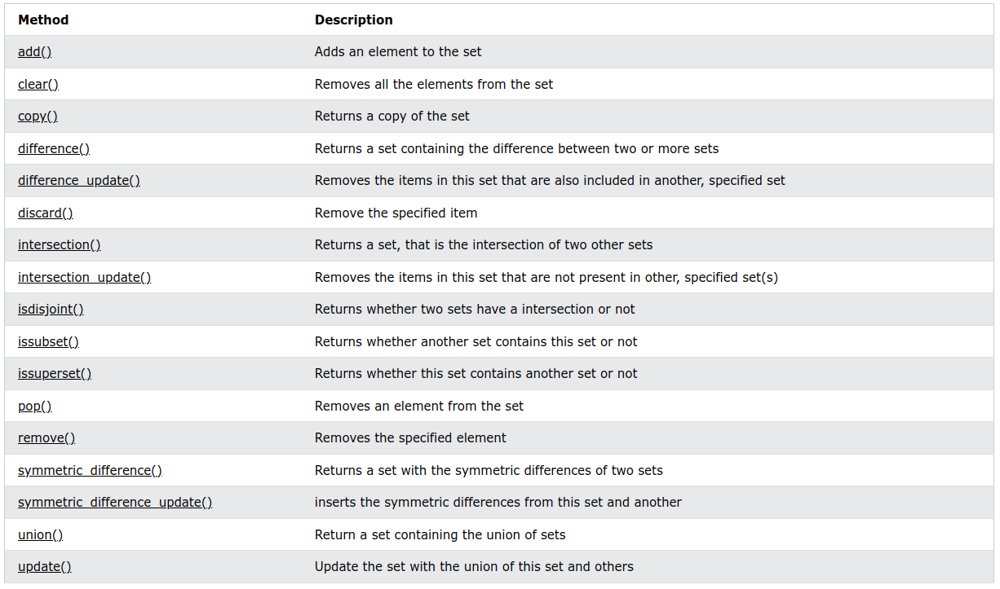

# Python Les Ensembles (Sets)

```python
myset = {"apple", "banana", "cherry"}
```

## Ensemble (Set)

Les ensembles sont utilisés pour stocker plusieurs éléments dans une seule variable.

**Set** est l'un des 4 types de données intégrés à Python utilisés pour stocker des collections de données..

Un ensemble est une collection ***non ordonnée***, ***non modifiable*** et ***non indexée***.

> **Remarque** : les éléments de l'ensemble ne sont pas modifiables, mais vous pouvez supprimer des éléments et en ajouter de nouveaux.

Les ensembles sont écrits avec des accolades.

**Exemple**

Créer un ensemble

```python
thisset = {"apple", "banana", "cherry"}  
print(thisset)
```

>Remarque : les ensembles ne sont pas ordonnés, vous ne pouvez donc pas être sûr de l'ordre dans lequel les éléments apparaîtront.

### Définir les éléments

Les éléments d'ensemble ne sont pas ordonnés, ne peuvent pas être modifiés et n'autorisent pas les valeurs en double.

### Non ordonné

Non ordonné signifie que les éléments d'un ensemble n'ont pas d'ordre défini.

Les éléments d'ensemble peuvent apparaître dans un ordre différent chaque fois que vous les utilisez et ne peuvent pas être référencés par un index ou une clé.

### Non modifiable

Les éléments de l'ensemble sont immuables, ce qui signifie que nous ne pouvons pas modifier les éléments une fois l'ensemble créé.

Une fois qu'un ensemble est créé, vous ne pouvez pas modifier ses éléments, mais vous pouvez supprimer des éléments et en ajouter de nouveaux.

### Doublons non autorisés

Les ensembles ne peuvent pas avoir deux éléments avec la même valeur.

**Exemple**

Les valeurs en double seront ignorées :

```python
thisset = {"apple", "banana", "cherry", "apple"}  
  
print(thisset)
```

>Remarque : Les valeurs `True` et `1` sont considérées comme identiques dans les ensembles et sont traitées comme des doublons :

**Exemple**

Vrai et 1 est considéré comme la même valeur :

```python
thisset = {"apple", "banana", "cherry", True, 1, 2}  
  
print(thisset)
```

### Obtenir la longueur d'un ensemble

Pour déterminer le nombre d'éléments d'un ensemble, utilisez la fonction `len()`.

**Exemple**

Obtenir le nombre d'éléments dans un ensemble :

```python
thisset = {"apple", "banana", "cherry"}  
  
print(len(thisset))
```

### Éléments d'ensemble - Types de données

Les éléments d'ensemble peuvent être de n'importe quel type de données :

**Exemple**

Types de données chaîne, int et booléen :

```python
set1 = {"apple", "banana", "cherry"}  
set2 = {1, 5, 7, 9, 3}  
set3 = {True, False, False}
```

Un ensemble peut contenir plusieurs types de données

**Exemple**

Un ensemble avec des valuers de types strings, integers, et boolean 

```python
set1 = {"abc", 34, True, 40, "male"}
```

### Le constructeur set()

Il est aussi possible d'utiliser le constructeur `set()` pour définir un ensemble

**Exemple**

```python
thisset = set(("apple", "banana", "cherry")) # note the double round-brackets  
print(thisset)
```

## Accéder aux éléments de l'ensemble

### Accéder aux éléments

Vous ne pouvez pas accéder aux éléments d'un ensemble en vous référant à un index ou à une clé.

Mais vous pouvez parcourir les éléments de l'ensemble à l'aide d'une boucle for ou demander si une valeur spécifiée est présente dans un ensemble à l'aide du mot-clé `in`.

**Exemple**

Parcourir l'ensemble et imprimer les valeurs :

```python
thisset = {"apple", "banana", "cherry"}  
  
for x in thisset:  
  print(x)
```

**Exemple**

Vérifier si "banana" se trouve dans l'ensemble

```python
thisset = {"apple", "banana", "cherry"}  
  
print("banana" in thisset)
```

## Ajouter des éléments d'ensemble

### Ajouter des éléments

> Une fois qu'un ensemble est créé, vous ne pouvez pas modifier ses éléments, mais vous pouvez ajouter de nouveaux éléments.

Pour ajouter un élément à un ensemble, utilisez la méthode `add()`.

**Exemple**

Ajouter un élément à un ensemble en utilisant la méthode `add()`.

```python
thisset = {"apple", "banana", "cherry"}  
  
thisset.add("orange")  
  
print(thisset)
```

### Ajouter des ensembles

Pour ajouter des éléments d'un autre ensemble dans l'ensemble actuel, utilisez la méthode `update()`.

**Exemple**

Ajouter les éléments de `tropical` dans `thisset`

```python
thisset = {"apple", "banana", "cherry"}  
tropical = {"pineapple", "mango", "papaya"}  
  
thisset.update(tropical)  
  
print(thisset)
```

### Ajouter n'importe quel itérable

L'objet dans la méthode update() n'a pas besoin d'être un ensemble, il peut s'agir de n'importe quel objet itérable (tuples, listes, dictionnaires, etc.).

**Exemple**

Ajouter des éléments d'une liste à un ensemble :

```python
thisset = {"apple", "banana", "cherry"}  
mylist = ["kiwi", "orange"]  
  
thisset.update(mylist)  
  
print(thisset)
```

## Supprimer les éléments de l'ensemble

### Supprimer un élément

Pour supprimer un élément dans un ensemble, utiliser la méthode `remove()` ou `discard()`

**Exemple**

Supprimer "banana" en utilisant la méthode `remove()`

```python
thisset = {"apple", "banana", "cherry"}
thiset.remove("banana")
print(thisset)
```

> Si l'élément à supprimer n'existe pas. `remove()` va générer une erreur.

**Exemple**

Supprimer "banana" en utilisant la méthode `discard()`

```python
thisset = {"apple", "banana", "cherry"}
thiset.discard("banana")
print(thisset)
```

> Si l'élément à supprimer n'existe pas. `discard()` ne générera pas  d'erreur.

Vous pouvez également utiliser la méthode `pop()` pour supprimer un élément, mais cette méthode supprimera un élément aléatoire, vous ne pouvez donc pas être sûr de l'élément supprimé.

La valeur de retour de la méthode `pop()` est l'élément supprimé.

**Exemple**

Supprimez un élément aléatoire en utilisant la méthode `pop() `:

```python
thisset = {"apple", "banana", "cherry"}  
  
x = thisset.pop()  
  
print(x)  
  
print(thisset)
```

> **Remarque** : les ensembles ne sont pas ordonnés, donc lorsque vous utilisez la méthode pop(), vous ne savez pas quel élément est supprimé.

**Exemple**

Le méthode `clear()` vide l'ensemble:

```python
thisset = {"apple", "banana", "cherry"}  
  
thisset.clear()  
  
print(thisset)
```

**Exemple**

Le mot clé `del` supprime définitivement l'ensemble:

```python
thisset = {"apple", "banana", "cherry"}  
  
del thisset
  
print(thisset)
```

## Joindre les ensembles (Set)

### Joindre deux ensembles

Il existe plusieurs façons de joindre deux ensembles ou plus en Python.

Vous pouvez utiliser la méthode `union()` qui renvoie un nouvel ensemble contenant tous les éléments des deux ensembles, ou la méthode `update()` qui insère tous les éléments d'un ensemble dans un autre :

**Exemple**

La méthode `union() `renvoie un nouvel ensemble avec tous les éléments des deux ensembles :

```python
set1 = {"a", "b" , "c"}  
set2 = {1, 2, 3}  
  
set3 = set1.union(set2)  
print(set3)
```

**Exemple**

La méthode update() insère les éléments de `set2` dans `set1` :

```python
set1 = {"a", "b" , "c"}  
set2 = {1, 2, 3}  
  
set1.update(set2)  
print(set1)
```

>**Remarque** : `union()` et `update() `excluront tous les éléments en double.

### Conservez UNIQUEMENT les doublons

La méthode` intersection_update()` ne conservera que les éléments présents dans les deux ensembles.

**Exemple**

Conservez les éléments qui existent à la fois dans l'ensemble x et dans l'ensemble y :

```python
x = {"apple", "banana", "cherry"}  
y = {"google", "microsoft", "apple"}  
  
x.intersection_update(y)  
  
print(x)
```

La méthode `intersection()` renverra un nouvel ensemble, qui ne contient que les éléments présents dans les deux ensembles.

**Exemple**

Renvoie un ensemble qui contient les éléments qui existent à la fois dans l'ensemble x et dans l'ensemble y :

```python
x = {"apple", "banana", "cherry"}  
y = {"google", "microsoft", "apple"}  
  
z = x.intersection(y)  
  
print(z)
```

### Conservez tout, mais PAS les doublons

La méthode `symmetric_difference_update()` ne conservera que les éléments qui ne sont PAS présents dans les deux ensembles.

**Exemple**

Conservez les éléments qui ne sont pas présents dans les deux ensembles :

```python
x = {"apple", "banana", "cherry"}  
y = {"google", "microsoft", "apple"}  
  
x.symmetric_difference_update(y)  
  
print(x)
```

La méthode `symmetric_difference()` renverra un nouvel ensemble, qui ne contient que les éléments qui ne sont PAS présents dans les deux ensembles.

**Exemple**

Renvoie un ensemble contenant tous les éléments des deux ensembles, à l'exception des éléments présents dans les deux :

```python
x = {"apple", "banana", "cherry"}  
y = {"google", "microsoft", "apple"}  
  
z = x.symmetric_difference(y)  
  
print(z)
```

> **Remarque** : Les valeurs `True` et `1` sont considérées comme identiques dans les ensembles et sont traitées comme des doublons :

**Exemple**

```python
x = {"apple", "banana", "cherry", True}  
y = {"google", 1, "apple", 2}  
  
z = x.symmetric_difference(y)
```

## Set Methods

### Les méthodes de l'ensemble

Python possède un ensemble de méthodes intégrées que vous pouvez utiliser sur des ensembles.


