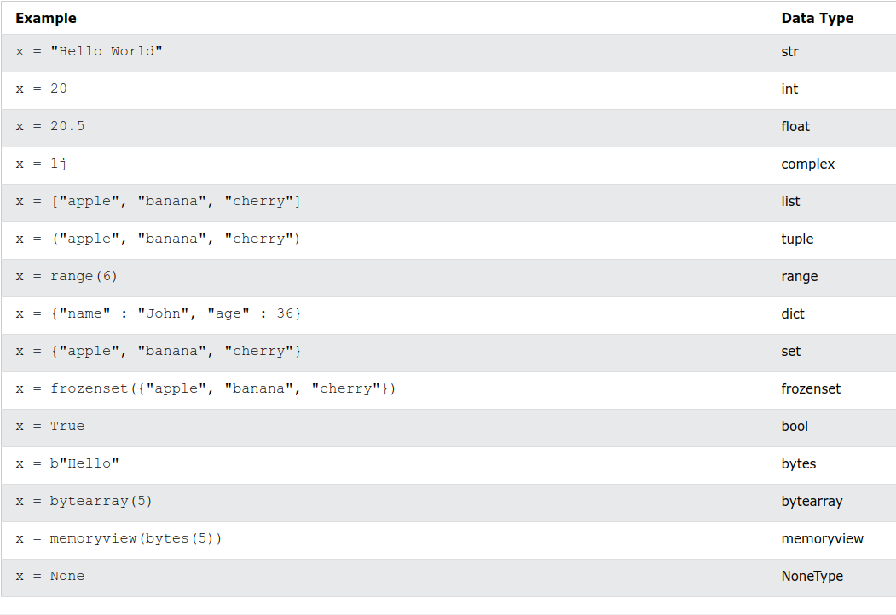
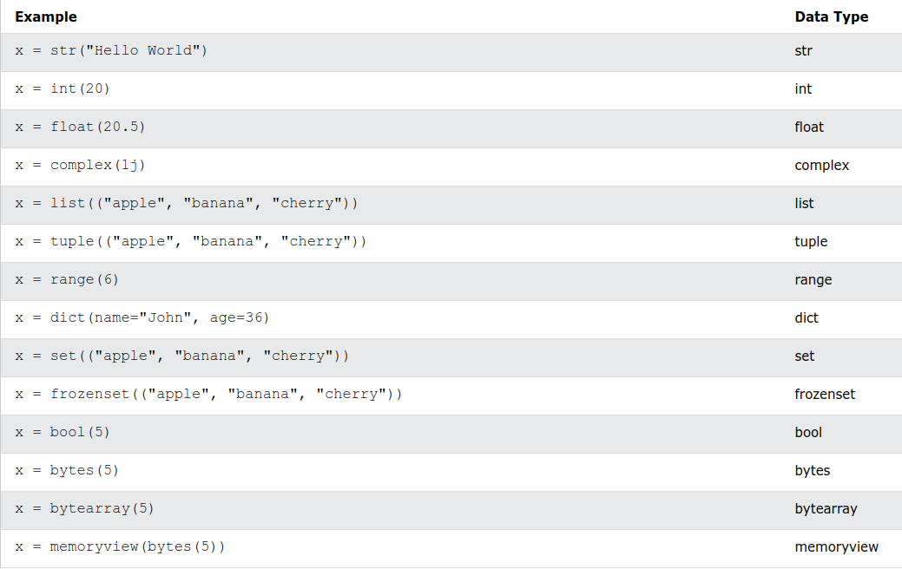

# Python - Types de données

## Types de données intégrés

En programmation, le type de données est un concept important.

Les variables peuvent stocker des données de différents types, et différents types peuvent faire différentes choses.

Python a les types de données suivants intégrés par défaut, dans ces catégories :

<table>
	<tr>
		<td>Text Type</td>
		<td>str</td>
	</tr>
	<tr>
		<td>Numeric Types</td>
		<td>int, float, complex</td>
	</tr>
	<tr>
		<td>Sequence Types</td>
		<td>list, tuple, range</td>
	</tr>
	<tr>
		<td>Mapping Type</td>
		<td>dict</td>
		</tr>
	<tr>
		<td>Set Types</td>
		<td>set, frozenset</td>
	</tr>
	<tr>
		<td>Boolean Type</td>
		<td>bool</td>
	</tr>
	<tr>
		<td>Binary Types</td>
		<td>bytes, bytearray, memoryview</td>
	</tr>
	<tr>
		<td>None Type</td>
		<td>NoneType</td>
	</tr>
</table>

## Obtenir le type de données

Vous pouvez obtenir le type de données de n'importe quel objet en utilisant la fonction __type()__

Imprimer le type de données de la variable x :

```python
x = 5
print(type(x))
```

## Définition du type de données

En Python, le type de données est défini lorsque vous affectez une valeur à une variable :



## Définition du type de données spécifique

Si vous souhaitez spécifier le type de données, vous pouvez utiliser les fonctions constructeur suivantes :



[Next ⟶](./python_7_numbers_more.md)