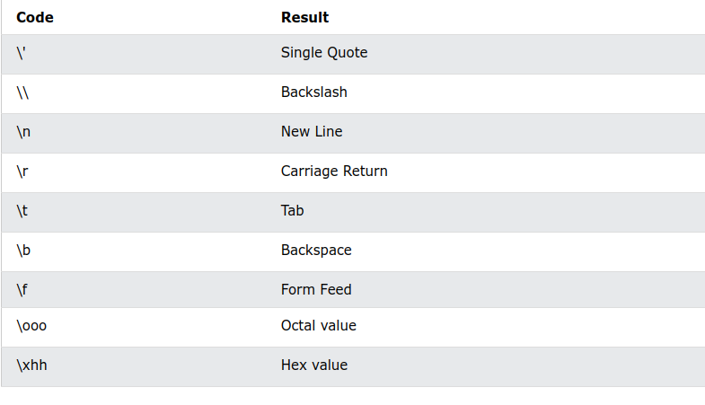

# Python - Numbers/Casting/Strings/Booleans

## Les Nombres

Il existe trois types numériques en Python :

- int (entier),
- float (flottant),
- complex (complexe),

Les variables de types numériques sont créées lorsque vous leur attribuez une valeur :

### Exemple

```python
x = 1    # int
y = 2.8  # float
z = 1j   # complex
```

Pour vérifier le type de n'importe quel objet en Python, utilisez la fonction type() :

```python
print(type(x))
print(type(y))
print(type(z))
```

### Int (entier)

Int, ou entier, est un nombre entier, positif ou négatif, sans décimales, de longueur illimitée.

#### Exemple

Entiers:

```python
x = 1
y = 35656222554887711
z = -3255522

print(type(x))
print(type(y))
print(type(z))
```

### Float

__Float__, ou "nombre à virgule flottante" est un nombre, positif ou négatif, contenant une ou plusieurs décimales.

#### Exemple

```python
x = 1.10
y = 1.0
z = -35.59

print(type(x))
print(type(y))
print(type(z))
```

__Float__ peut également être un nombre scientifique avec un "e" pour indiquer la puissance de 10.

```python
x = 35e3
y = 12E4
z = -87.7e100

print(type(x))
print(type(y))
print(type(z))
```

### Complexe

Les nombres complexes s'écrivent avec un "j" comme partie imaginaire :

#### Exemple

```python
x = 3+5j
y = 5j
z = -5j

print(type(x))
print(type(y))
print(type(z))
```

### Conversion de type

Vous pouvez convertir d'un type à un autre avec les méthodes int(), float() et complex() :

#### Exemple

Convertir d'un type à un autre :

```python
x = 1    # int
y = 2.8  # float
z = 1j   # complex

#convert from int to float:
a = float(x)

#convert from float to int:
b = int(y)

#convert from int to complex:
c = complex(x)

print(a)
print(b)
print(c)

print(type(a))
print(type(b))
print(type(c))
```

__Remarque__ : Vous ne pouvez pas convertir des nombres complexes en un autre type de nombre.

### Random Number (Nombre aléatoire)

Python n'a pas de fonction random() pour faire un nombre aléatoire, mais Python a un module intégré appelé random qui peut être utilisé pour faire des nombres aléatoires :

#### Exemple

Importez le module random, et affichez un nombre aléatoire entre 1 et 9 :

```python
import random

print(random.randrange(1, 10)
```

## Python - Casting

### Spécifier un type de variable

Il peut arriver que vous souhaitiez spécifier un type sur une variable. Cela peut être fait avec le casting. Python est un langage orienté objet et, en tant que tel, il utilise des classes pour définir les types de données, y compris ses types primitifs.

Le casting en python se fait donc à l'aide de fonctions constructeur :

- **int()** - construit un nombre entier à partir d'un littéral entier, d'un littéral flottant (en supprimant toutes les décimales) ou d'un littéral de chaîne (à condition que la chaîne représente un nombre entier)
- **float()** - construit un nombre flottant à partir d'un littéral entier, d'un littéral flottant ou d'un littéral de chaîne (à condition que la chaîne représente un flottant ou un entier)
- **str()** - construit une chaîne à partir d'une grande variété de types de données, y compris des chaînes, des littéraux entiers et des littéraux flottants

#### Exemple 1

Entiers:

```python
x = int(1)   # x will be 1
y = int(2.8) # y will be 2
z = int("3") # z will be 3
```

#### Exemple 2

Floats (flottants)

```python
x = float(1)     # x will be 1.0
y = float(2.8)   # y will be 2.8
z = float("3")   # z will be 3.0
w = float("4.2") # w will be 4.2
```

#### Exemple 3

Strings

```python
x = str("s1") # x will be 's1'
y = str(2)    # y will be '2'
z = str(3.0)  # z will be '3.0'
```

## Python - Strings

### Stings (Chaînes)

Les chaînes en python sont entourées soit de guillemets simples, soit de guillemets doubles.

'bonjour' est la même chose que "bonjour".

Vous pouvez afficher un littéral de chaîne avec la fonction print() :

**Exemple**

```python
print("Bonjour")
print('Bonjour')
```

#### Affecter une chaîne à une variable

L'affectation d'une chaîne à une variable se fait avec le nom de la variable suivi d'un signe égal et de la chaîne :

*** Exemple ***

```python
a = "Hello"
print(a)
```

#### Chaînes Multi-lignes

Vous pouvez affecter une chaîne multi-lignes à une variable en utilisant trois guillemets :

**Exemple**

Vous pouvez utiliser trois guillemets :

```python
demoText = """Lorem ipsum dolor sit amet,
consectetur adipiscing elit,
sed do eiusmod tempor incididunt
ut labore et dolore magna aliqua."""

print(demoText)
```

***Note:*** Vous pouvez aussi utiliser trois guillemets simples.

**Remarque :** dans le résultat, les sauts de ligne sont insérés à la même position que dans le code.

#### Les chaînes sont des tableaux

Comme beaucoup d'autres langages de programmation populaires, les chaînes en Python sont des tableaux d'octets représentant des caractères Unicode.

Cependant, Python n'a pas de type de données caractère, un seul caractère est simplement une chaîne d'une longueur de 1.

Les crochets peuvent être utilisés pour accéder aux éléments de la chaîne.

**Exemple**

Obtenez le caractère à la position 1 (rappelez-vous que le premier caractère a la position 0) :

```python
a = "Hello, World!"
print(a[1])
```

### Boucle sur une chaîne

Puisque les chaînes sont des tableaux, nous pouvons parcourir les caractères d'une chaîne, avec une boucle for.

**Exemple**

Parcourez les lettres du mot "banane":

```python
for x in "banana":
  print(x)
```

Vous apprendrez plus sur la boucle **for** dans un chapitre ultérieur.

#### Longueur de chaine (String Length)

Pour obtenir la longueur d'une chaîne, utilisez la fonction ***len()***.

**Exemple**

La fonction len() renvoie la longueur d'une chaîne :

```python
a = "Hello, World!"
print(len(a))
```

#### Vérifier une chaîne

Pour vérifier si une certaine phrase ou un certain caractère est présent dans une chaîne, nous pouvons utiliser le mot-clé ***in***.

**Exemple**

Vérifiez si "futur" est présent dans le texte suivant :

```python
txt = "Python est le langage du futur!"
print("futur" in txt)
```

Utilisez-le dans une instruction if :

**Exemple**

Imprimer uniquement si "futur" est présent :

```python
if "futur" in txt:
	print("Ouais! C'est bien le langage du futur")
```

#### Vérifier si NON

Pour vérifier si une certaine phrase ou un certain caractère n'est PAS présent dans une chaîne, nous pouvons utiliser le mot-clé **_not in_**.

**Exemple**

Vérifiez si "coûteux" n'est PAS présent dans le texte suivant :

```python
txt = "Les meilleures choses dans la vie sont gratuites!"
print("coûteux" not in txt)
```

Utilisez-le dans une instruction if :

**Exemple**

Imprimez seulement si "gratuit" n'est pas présent:

```python
txt = "Les meilleures choses dans la vie sont gratuites!"
if "coûteux" not in txt:
	print("Non, 'coûteux' n'est pas présent.")
```

### Python - Slicing Strings (découpage de chaînes)

#### Slicing (Tranchage ou découpage)

Vous pouvez renvoyer une plage de caractères en utilisant la syntaxe **_slice_**.

Spécifiez l'index de début et l'index de fin, séparés par deux points, pour renvoyer une partie de la chaîne.

**Exemple**

Obtenez les caractères de la position 2 à la position 5 (non inclus) :

```python
b = "Hello, World!"
print(b[2:5])
```

**Remarque** : Le premier caractère a l'index 0.

#### Trancher depuis le début

En omettant l'index de début, la plage commencera au premier caractère :

**Exemple**

Obtenez les caractères du début à la position 5 (non inclus) :

```python
b = "Hello, World!"
print(b[:5])
```

#### Trancher depuis la fin

En omettant l'index de fin, la plage ira jusqu'à la fin :

**Exemple**

Obtenez les caractères de la position 2, et jusqu'à la fin :

```python
b = "Hello, World!"
print(b[2:])
```

#### Indexation négative

Utilisez des index négatifs pour démarrer le slicing à partir de la fin de la chaîne :

**Exemple**

Obtenez les personnages :

De : "o" dans "World !" (position -5)

À, mais non inclus : "d" dans "World !" (position -2) :

```python
b = "Hello, World!"
print(b[-5:-2])
```

### Python - Modifier les chaînes

Python possède un ensemble de méthodes intégrées que vous pouvez utiliser sur des chaînes.

#### Upper Case

La méthode upper() renvoie la chaîne en majuscule :

```python
a = "Hello, World!"
print(a.upper())
```

#### Lower Case

La méthode upper() renvoie la chaîne en majuscule :

```python
a = "Hello, World!"
print(a.lower())
```

#### Supprimer les espaces blancs

L'espace blanc est l'espace avant et/ou après le texte réel, et très souvent vous souhaitez supprimer cet espace.

**Exemple**

La méthode ***strip()*** supprime tout espace blanc au début ou à la fin :

```python
a = " Hello, World! "
print(a.strip()) # returns "Hello, World!"
```

#### Remplacer une chaîne

La méthode ***replace()*** remplace une chaîne par une autre :

```python
a = "Hello, World!"
print(a.replace("H", "J"))
```

#### Séparer une chaîne

La méthode ***split()*** renvoie une liste où le texte entre le séparateur spécifié devient les éléments de la liste.

**Exemple**
La méthode ***split()*** divise la chaîne en sous-chaînes si elle trouve des instances du séparateur :

```python
a = "Hello, World!"
print(a.split(",")) # returns ['Hello', ' World!']
```

### Python - Concaténation de chaînes

#### Concaténation de chaînes à l'aide de l'opérateur +

Pour concaténer ou combiner deux chaînes, vous pouvez utiliser l'opérateur __+__.

**Exemple**

Fusionnez la variable a avec la variable b dans la variable c :

```python
a = "Hello"
b = "World"
c = a + b
print(c)
```

Pour ajouter un espace entre elles, ajoutez un " " :

```python
a = "Hello"
b = "World"
c = a + " " + b
print(c)
```

#### Concaténation de chaînes à l'aide de la fonction join()

Nous pouvons utiliser la fonction __join()__ pour concaténer une chaîne avec un séparateur. C'est utile lorsque nous avons une séquence de chaînes, par exemple une liste ou un tuple de chaînes. Si vous ne voulez pas de séparateur, utilisez la fonction __join()__ avec une chaîne vide.

**Exemple**

```python
s1 = 'Hello'
s2 = 'World'

print('Concatenated String using join() =', "".join([s1, s2]))

print('Concatenated String using join() and whitespaces =', " ".join([s1, s2]))
```

#### Concaténation de chaînes à l'aide de la fonction format()

On peut également utiliser la fonction string __format()__ pour la concaténation et le formatage des chaînes.

**Exemple**

```python
s1 = 'Hello'
s2 = 'World'

s3 = "{}-{}".format(s1, s2)
print('String Concatenation using format() =', s3)

s3 = "{in1} {in2}".format(in1=s1, in2=s2)
print('String Concatenation using format() =', s3)
```

#### Concaténation de chaînes à l'aide de f-string

Si vous utilisez Python 3.6+, vous pouvez également utiliser **f-string** pour la concaténation de chaînes.

**Exemple**

```python
s1 = 'Hello'
s2 = 'World'

s3 = f'{s1} {s2}'
print('String Concatenation using f-string =', s3)

name = 'John'
age = 34

print(f'{name} age is {age}')
```

### Python - Caractères d'échappement

Pour insérer des caractères non autorisés dans une chaîne, utilisez un caractère d'échappement.

Un caractère d'échappement est une barre oblique inverse \ (anti-slash) suivie du caractère que vous souhaitez insérer.

Un exemple de caractère illégal est un guillemet double à l'intérieur d'une chaîne entourée de guillemets doubles :

**Exemple**

Vous obtiendrez une erreur si vous utilisez des guillemets doubles dans une chaîne entourée de guillemets doubles :

```python
txt = "We are the so-called "Vikings" from the north."
```

Pour résoudre ce problème, utilisez le caractère d'échappement **\\"** :

**Exemple**

Le caractère d'échappement vous permet d'utiliser des guillemets doubles lorsque vous n'y êtes normalement pas autorisé :

```python
txt = "We are the so-called \"Vikings\" from the north."
```

Autres caractères d'échappement utilisés en Python :



### Python - Méthodes de chaîne (String methods)

Python possède un ensemble de méthodes intégrées que vous pouvez utiliser sur des chaînes.

**Remarque** : Toutes les méthodes de chaîne renvoient de nouvelles valeurs. Ils ne changent pas la chaîne d'origine.

| **Method**   | **Description**                                                                          |
|--------------|------------------------------------------------------------------------------------------|
| capitalize() | Converts the first character to upper case                                               |
| casefold()   | Converts string into lower case                                                          |
| center()     | Returns a centered string                                                                |
| count()      | Returns the number of times a specified value occurs in a string                         |
| encode()     | Returns an encoded version of the string                                                 |
| endswith()   | Returns true if the string ends with the specified value                                 |
| find()       | Searches the string for a specified value and returns the position of where it was found |
| format()     | Formats specified values in a string                                                     |
| isalnum()    | Returns True if all characters in the string are alphanumeric                            |
| isalpha()    | Returns True if all characters in the string are in the alphabet                         |
| isdecimal()  | Returns True if all characters in the string are decimals                                |
| isdigit()    | Returns True if all characters in the string are digits                                
|upper()	| Converts a string into upper case|
|title() | Converts the first character of each word to upper case|
|swapcase() | Swaps cases, lower case becomes upper case and vice versa|


[Next]()