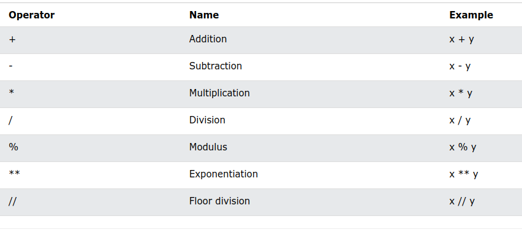
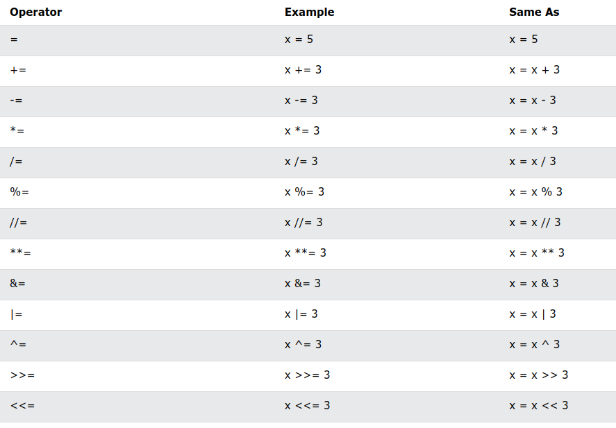
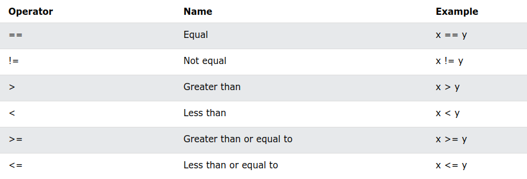
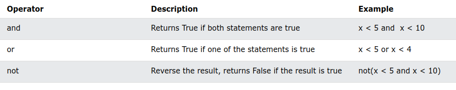
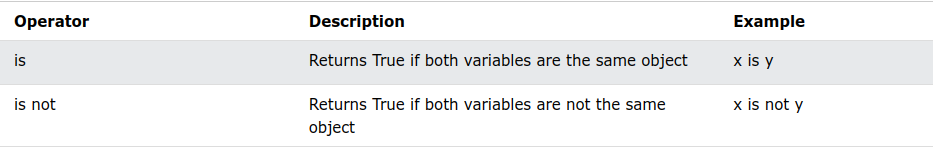
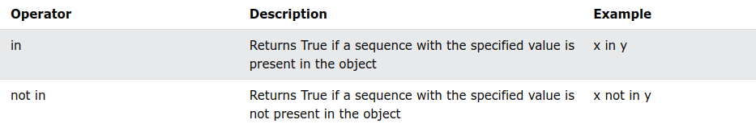

# Python Operators

## Les opérateurs

Opérateurs Python
Les opérateurs sont utilisés pour effectuer des opérations sur des variables et des valeurs.

Dans l'exemple ci-dessous, nous utilisons l'opérateur + pour additionner deux valeurs :

**Exemple**

```python
print(10 + 5)
```

Python divise les opérateurs dans les groupes suivants :

* Opérateurs arithmétiques
* Opérateurs d'affectation
* Opérateurs de comparaison
* Opérateurs logiques
* Opérateurs d'identité
* Opérateurs d'adhésion
* Opérateurs au niveau du bit

## Les opérateurs arithmétiques

Les opérateurs arithmétiques sont utilisés avec des valeurs numériques pour effectuer des opérations mathématiques courantes :



## Les opérateurs d'affectation

Les opérateurs d'affectation sont utilisés pour affecter des valeurs aux variables :



## Les opérateurs de comparaison

Les opérateurs de comparaison sont utilisés pour comparer deux valeurs :



## Les opérateurs logiques

Les opérateurs logiques sont utilisés pour combiner des instructions conditionnelles :



## Les opérateurs d'identité

Les opérateurs d'identité sont utilisés pour comparer les objets, non pas s'ils sont égaux, mais s'ils sont en fait le même objet, avec le même emplacement mémoire:



## Les opérateurs d'appartenance

Les opérateurs d'appartenance sont utilisés pour tester si une séquence est présentée dans un objet :



[Next](./python_10_lists.md)

